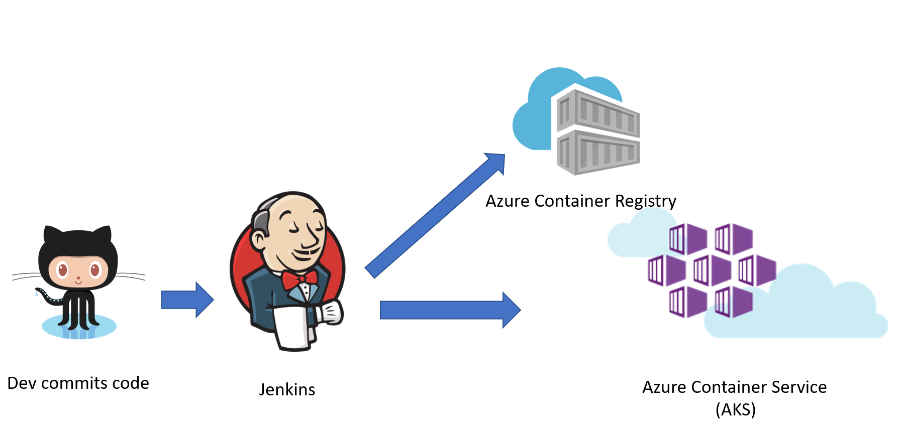

# Prerequisites

* [Azure cli](https://docs.microsoft.com/en-us/cli/azure/install-azure-cli-apt?view=azure-cli-latest)  
* [.NET Core 2.1](https://www.microsoft.com/net/download/linux-package-manager/ubuntu16-04/sdk-2.1.300)  
* [docker](https://docs.docker.com/install/linux/docker-ce/ubuntu/)  
* [kubectl](https://kubernetes.io/docs/tasks/tools/install-kubectl/)  

# Deploy application

1. login your Azure CLI, and set your subscription id
    ```bash
    az login
    az account set -s <your-subscription-id>
    ```

1. set group_suffix value
    ```bash
    group_suffix=$((RANDOM % 100000))
    ```

1. set target location
    ```bash
    targetlocation=eastus
    ```

1. generate resource group names
    ```bash
    resource_group=AspnetCoreDemo${group_suffix}
    ```

1. create resource group and provision Azure ACR
    ```bash
    az group create -n ${resource_group} -l ${targetlocation}
    az acr create -n ${resource_group,,} -g ${resource_group} --admin-enabled true --sku Standard
    export acr_name=${resource_group,,}
    export acr_username=$(az acr credential show -g ${resource_group} -n ${acr_name} --query username | tr -d '"')
    export acr_password=$(az acr credential show -g ${resource_group} -n ${acr_name} --query passwords[0].value | tr -d '"')
    export acr_server=$(az acr show -g ${resource_group} -n ${acr_name} --query loginServer | tr -d '"')
    ```

1. create Azure Application Insights
    ```bash
    az resource create -g ${resource_group} --resource-type "Microsoft.Insights/components" -n ${resource_group}ai -l ${targetlocation} --properties '{"ApplicationId":"facerecognition","Application_Type":"other", "Flow_Type":"Redfield", "Request_Source":"IbizaAIExtension"}'
    export ai_key=$(az resource show -g ${resource_group} --resource-type "Microsoft.Insights/components" -n ${resource_group}ai --query properties.InstrumentationKey --o tsv)
    ```

1. create Azure Kubernetes Service (AKS)
    ```bash
    az aks create -g ${resource_group} -n aks --node-count 1 --generate-ssh-keys
    ```

1. create secret in AKS
    ```bash
    az aks get-credentials --resource-group ${resource_group} --name aks --admin
    kubectl create secret docker-registry regsecret --docker-server=${acr_server} --docker-username=${acr_username} --docker-password=${acr_password} --docker-email=xy@test.com
    kubectl create secret generic aspnetcoredemo-secrets --from-literal=AppInsightsKey=$ai_key
    ```

1. build application and push to docker registry
    ```bash
    docker login ${acr_server} -u ${acr_username} -p ${acr_password}
    docker build -f src/CustomersAPI/Dockerfile -t $acr_server/customersapi:0 .
    docker push $acr_server/customersapi:0
    docker build -f src/CustomersMVC/Dockerfile -t $acr_server/customersmvc:0 .
    docker push $acr_server/customersmvc:0
    ```

1. deploy application into AKS
    ```bash
    cat cicd/k8s.yaml | sed -e "s/YourACRName/${acr_username}/g" -e "s/build_number/0/g" | kubectl create -f -
    ```

# Setup CICD pipeline

## This is the workflow  

   

1. provision Jenkins host  
    [Create a Jenkins server on an Azure Linux VM from the Azure portal](https://docs.microsoft.com/en-us/azure/jenkins/install-jenkins-solution-template)

1. install docker, kubectl on Jenkins machine

1. create a new pipeline job and define parameters "git_repo", "acr_username", "acr_password", "registry_url"

1. Set **Definition** to **Pipeline script from SCM** and **Script Path** to cicd/Jenkinsfile
